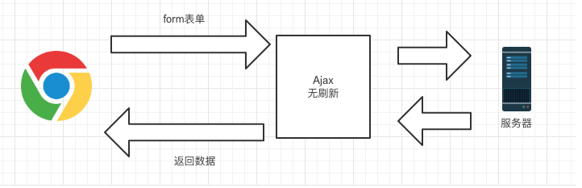

## 单页与多页应用有什么区别？

::: tip 参考
首先我们先区分开两者的区别：

**单页面应用（SPA）**

时下流行的一种应用模式，只加载一个 html 文件，页面切换其实只是切换组件（页面片段），实际都是在这个页面内部通过动态加载组件来实现页面跳转的效果。从实现上来讲，主要是监听 url 变化，通过路由来动态加载或卸载某些组件。
- 优点
  - 页面切换快，响应更加迅速
  - 相对来说对服务器压力小，因为内容的改变不需要重新加载整个页面
  - 前后端分离，职责更加明确
- 缺点
  - 首屏加载速度慢
  - 不利于 SEO
  - 抛开易上手的 vue 来讲，其他的框架学习成本较高

**多页面应用**

多页面应用更倾向于传统的开发模式，每一次页面跳转的时候，后台服务器都会返回一个新的 html 文档，这种类型的网站就是多页网站，也叫做多页应用。
- 优点
  - 首屏加载速度快——首屏时间叫做页面首个屏幕的内容展现的时间，当我们访问页面的时候，服务器返回一个 html，页面就会展现出来，这个过程只经历了一个 HTTP 请求，所以页面展示的速度非常快。
  - 搜索引擎优化效果好（SEO）——搜索引擎在做网络排名的时候，要根据页面内容才能给网页权重，来进行网页的排名。搜索引擎是可以识别 html 内容的，而我们每个页面所有的内容都放在 html 中，所以这种多页应用的SEO效果是很好的。
- 缺点
  - 页面切换慢——这个相对于SPA来说是肯定的，因为它的每次跳转都需要发出一个 http 请求，如果网络比较慢，在页面之间来回跳转，就会有明显的卡顿。
:::

## 如何处理单页应用首次加载较慢问题

## ajax 和 fetch、asios 的区别

::: tip 参考
**Ajax**

我们说的 Ajax 是 `Asynchronous JavaScript and XML` 的缩写，意思是异步网络请求。区别于传统 web 开发中采用的同步方式。

Ajax 带来的最大影响就是页面可以无属性的请求数据。

传统 web 请求方式：


使用 Ajax 后请求：



**实现一个 ajax 请求**

在现代浏览器上实现一个 ajax 请求：

```js
var request = new XMLHttpRequest();  // 创建 XMLHttpRequest 对象

// ajax 是异步的，设置回调函数
request.onreadystatechange = function () {  // 状态发生变化时，函数被回调
  if (request.readyState === 4) {  // 成功完成
    // 判断响应状态码
    if (request.status === 200) {
      // 成功，通过 responseText 拿到响应的文本
      return success(request.responseText)
    } else {
      // 失败，根据响应码判断失败原因
      return fail(request.status)
    }
  } else {
    // HTTP 请求还在继续...
  }
}

// 发送请求
request.open('GET', '/api/details')
request.setRequestHeader('Content-Type', 'application/json')  // 设置请求头
request.send()  // 到这一步，请求才正式发出
```

实际项目中我们还是会采用一些封装好的库来使用，原生方法比较繁琐，比如经典的 jQuery 就有封装好的 ajax 方法。
:::

## 路由守卫

## v-for 与v-if 哪个先加载

## watch

## vue的get 与set  方法 区别及使用

## 深拷贝浅拷贝

## Object.keys()

## Object.assign()

## 原生的绑定事件的方法有几种

## 对 Typescript 有多少了解

## foreach和map的区别

