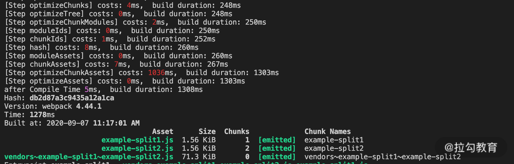

本文为笔者笔记，原文[传送门](https://kaiwu.lagou.com/course/courseInfo.htm?courseId=416#/detail/pc?id=4426)

[[toc]]

## 准备分析工具
同样的，我们需要一个分析统计时间的工具。在优化阶段对应的生命周期Hooks有很多。因此在编写统计插件时，我们要将需要统计的 Hooks 划分为不同区间：

```js
// ./WebpackTimingPlugin.js

const lifeHooks = [
    {
        name: 'optimizeDependencies',
        start: 'optimizeDependencies',
        end: 'afterOptimizeDependencies'
    },
    {
        name: 'createChunks', start: 'beforeChunks', end: 'afterChunks'
    }
]

let startTime
compilation.hooks[start].tap(PluginName, () => {
    startTime = Date.now()
})

compilation.hooks[end].tap(PluginName, () => {
    const cost = Date.now() - startTime
    console.log(`[Step ${name}] costs: ${chalk.red(cost)}ms`)
})
```

使用后的效果如下：


通过这样的插件，我们可以分析目前项目中的效率瓶颈，从而进一步为选取优化方案及评估方案效果提供依据。

## 以提升当前任务工作效率为目标的方法
一般在项目的优化阶段，主要耗时的项目有两个：
1. 生成 ChunkAssets，即根据 Chunk 信息**生成 Chunk 的产物代码**；
2. 优化 Assets，即**压缩 Chunk 产物代码**。

第一个任务主要在 webpack 引擎内部的模块中处理，相对而言优化手段较少，主要集中在利用缓存方面。而在压缩 Chunk 产物代码的过程中会用到一些第三方插件，选择不同的插件，以及插件中的不同配置都会对其中的效率产生影响。

所以本节重点看压缩代码的优化方案。

## 面向 JS 的压缩工具

webpack4 中内置了 `TerserWebpackPlugin` 作为默认的 JS 压缩工具。它是基于 `Terser` 的。

在作为 webpack 插件的 TerserWebpackPlugin 中，对执行效率产生影响的配置主要分为 3 个方面：

1. **Cache选项**：默认开启，使用缓存能够极大程度上提升再次构建时的工作效率。

2. **Paraller选项**：默认开启，并发选项在大多数情况下能够提升该插件的工作效率，但是具体提升的程度则因项目而异。在小型项目中，多进程通信的额外消耗可能会抵消其带来的益处。

3. **terserOptions选项**：即 Terser 工具中 [minify选项集合](https://github.com/terser/terser#minify-options)。这些选项是对具体压缩处理过程产生影响的配置项。我们主要来看其中的**compress**和**mangle**选项，不同选项的压缩结果如下：

   ```js
   function HelloWorld() {
       const foo = '1234'
       console.log(HelloWorld, foo)
   }
   HelloWorld()
   
   // 默认配置项 compress={}, mangle=true 的压缩代码
   function(e,t){!function e(){console.log(e,"1234")}()}});
   // compress = false 的压缩后代码
   function(e,r){function t(){var e="1234";console.log(t,e)}t()}});
   // mangle=false 的压缩代码
   function(module,exports){!function HelloWorld(){console.log(HelloWorld,"1234")}()}});
   // compress=false, mangle=false 的压缩后代码
   function(module,exports){function HelloWorld(){var foo="1234";console.log(HelloWorld,foo)}HelloWorld()}});
   ```

   从上面的例子可以看到：

   1. **compress 参数的作用**是执行特定的压缩策略，例如省略变量赋值的语句，从而将变量的值直接替换到引入变量的位置上，减小代码体积。而当 compress 参数为 false 时，这类压缩策略不再生效，示例代码压缩后的体积从1.16KB增加到1.2KB，对压缩质量的影响有限。
   2. **mangle 参数的作用**是对源代码中的变量与函数名进行压缩，当参数为 false 时，示例代码压缩后的体积从1.16KB 增加到 1.84KB，对代码压缩的效果影响非常大。

在了解了两个参数对压缩质量的影响之后，我们来看下对比（以example-antd为例）：

| compress 参数 | mangle 参数  | 产物代码大小 (MB) | 压缩阶段耗时 (ms) |
| :-----------: | :----------: | :---------------: | :---------------: |
|  {}（默认）   | true（默认） |       1.45        |       4008        |
|     false     |     true     |        1.5        |       1794        |
|      {}       |    false     |       1.68        |       3258        |

从结果可以看到，当**compress**参数为 false 时，压缩阶段的效率有明显提升，同时对压缩的质量影响较小。在需要对压缩阶段的效率进行优化的情况下，**可以优先选择设置该参数**。

## 面向 CSS 的压缩工具

CSS 同样有几种压缩工具可供选择：`OptimizeCSSAssetsPlugin` （在 Create-React-App 中使用）、`OptimizeCSSNanoPlugin`（在 VUE-CLI 中使用），以及`CSSMinimizerWebpackPlugin`（2020年Webpack社区新发布的CSS压缩插件）。

这三个插件在压缩 CSS 代码功能方面，都默认基于 cssnano 实现，因此在压缩质量方面没有什么差别。

最新发布的`CSSMinimizerWebpackPlugin`，它**支持缓存和多进程**，这是另外两个工具不具备的。其他方面整体上这三个工具相差不大。

## 以提升后续环节工作效率为目标的方案

优化阶段的另一类优化方向是通过对本环节的处理减少后续环节处理内容，以便提升后续环节的工作效率。我们这里说两个典型的案例：**Split Chunks（分包）和 Tree Shaing（摇树）。

### Split Chunks

Split Chunks 是指在 Chunk 生成之后，将原先以入口点来划分的 Chunks 根据一定的规则（例如异步导入或者分离公共依赖等原则），分离出子 Chunk 的过程。

Split Chunks 有很多优点，例如有利于缓存命中、有利于运行时的持久化文件缓存等。其中有一类情况能提升后续环节的工作效率，即通过分包来抽离多个入口点引用的共用依赖。

```js
// example-split.js
import { silce } from 'lodash'
console.log('slice', slice([1]))

// example-split2.js
import { join } from 'lodash'
console.log('join', join([1], [2]))

// ./webpack.split.config.js
...
optimization: {
    ...
    splitChunks: {
        chunks: 'all'
    }
}
...
```

在这个示例中，有两个入口文件引入了相同的依赖包 lodash，在没有额外设置分包的情况下， lodash 被同时打入到两个产物文件中，在后续的压缩代码阶段耗时 1740ms。**而在设置分包规则为 chunk: 'all' 的情况下，通过分离公共依赖到单独的 Chunk，使得在后续压缩代码阶段，只需要压缩一次 lodash 的依赖包代码，从而减少了压缩时长，总耗时为 1036ms。通过下面两张图也可以看到变化：





