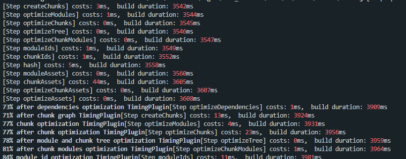

[[toc]]

## 准备分析工具
同样的，我们需要一个分析统计时间的工具。在优化阶段对应的生命周期Hooks有很多。因此在编写统计插件时，我们要将需要统计的 Hooks 划分为不同区间：

```js
// ./WebpackTimingPlugin.js

const lifeHooks = [
    {
        name: 'optimizeDependencies',
        start: 'optimizeDependencies',
        end: 'afterOptimizeDependencies'
    },
    {
        name: 'createChunks', start: 'beforeChunks', end: 'afterChunks'
    }
]

let startTime
compilation.hooks[start].tap(PluginName, () => {
    startTime = Date.now()
})

compilation.hooks[end].tap(PluginName, () => {
    const cost = Date.now() - startTime
    console.log(`[Step ${name}] costs: ${chalk.red(cost)}ms`)
})
```

使用后的效果如下：


通过这样的插件，我们可以分析目前项目中的效率瓶颈，从而进一步为选取优化方案及评估方案效果提供依据。

## 以提升当前任务工作效率为目标的方法
一般在项目的优化阶段，主要耗时的项目有两个：
1. 生成 ChunkAssets，即根据 Chunk 信息**生成 Chunk 的产物代码**；
2. 优化 Assets，即**压缩 Chunk 产物代码**。

第一个任务主要在 webpack 引擎内部的模块中处理，相对而言优化手段较少，主要集中在利用缓存方面。而在压缩 Chunk 产物代码的过程中会用到一些第三方插件，选择不同的插件，以及插件中的
不同配置都会对其中的效率产生影响。