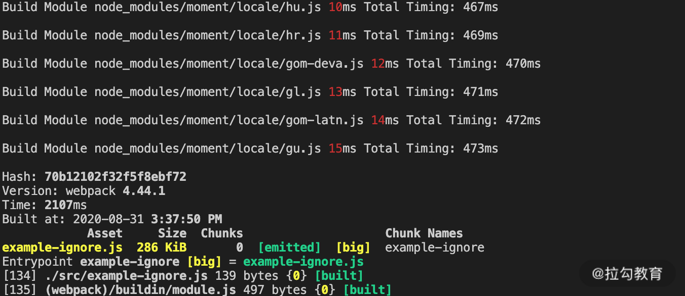

本文是笔者笔记，原文[传送门](https://kaiwu.lagou.com/course/courseInfo.htm?courseId=416#/detail/pc?id=4425)。

说到提速，那首先我们应该想到耗时。对于 webpack 中的两个核心—— Compiler 和 Compilation 工作流程，最耗时的阶段分别是哪个。

对于 Compiler 实例而言，耗时最长的显然是生成编译过程实例后的 make 阶段，在这个阶段里，会执行模块编译到优化的完整过程。

而对于 Compilation 实例的工作流程来说，不同的项目和配置各有不同，但总体而言，编译模块和后续优化阶段的生成产物并压缩代码的过程都是比较耗时的。

那么不同项目的构建，在整个流程的前期初始化阶段和最后的产物生成阶段的构建时间区别不大。真正影响整个构建效率的还是 Compilation 实例的处理过程，这一过程又可以分为两个阶段：**编译模块和优化处理**。

[[toc]]

## 优化前的准备工作

1. **准备基于时间的分析工具**：我们需要一类插件，来帮助我们统计项目构建过程中在编译阶段的耗时情况。例如`speed-measure-webpack-plugin`。
2. **准备基于产物内容的分析工具**：从产物内容着手分析是另一个可行的方式，因为从中我们可以找到对产物包体积影响最大的包的构成，从而找到那些冗余的、可以被优化的依赖项。通常，减少这些冗余的依赖包模块，不仅能减小最后的包体积大小，也能提升构建模块时的效率。通常使用 `webpack-bundle-analyzer` 分析产物内容。

在准备好相应的分析工具后，接下来，就开始分析编译阶段的具体提效方向。编译模块阶段所耗的时间是从单个入口点开始，编译每个模块的时间的总和。要提升这一阶段的构建效率，大致可以分为三个方法：

1. 减少执行编译的模块；
2. 提升单个模块的构建速度；
3. 并行构建以提升总体效率。

### 减少执行构建的模块

提升编译模块阶段效率的第一个方向就是减少执行编译的模块。显而易见，如果一个项目每次构建都需要编译 1000 个模块，但是通过分析后发现其中有 500 个不需要编译，显而易见，经过优化后，构建效率可以大幅提升。当然，前提是找到原本不需要进行构建的模块。

#### IgnorePlugin

有的依赖包，除了项目所需的模块内容外，还会附带一些多余的模块。典型的例子是 moment 这个包，一般情况下在构建时会自动引入其 locale 目录下的多国语言包。



但对于大多数情况而言，项目中只需要引入本国语言包即可。而 Webpack 提供的 IgnorePlugin 即可在构建模块时直接剔除那些需要被排除的模块，从而提升构建模块的速度，并减少产物体积。

```js
// webpack.config.js
module.exports = {
    ...
    plugins: [
        new webpack.IgnorePlugin({
            resourceRegExp: /^\.\/locale$/,
            contextRegExp: /moment$/
        })
    ]
    ...
}
```

#### 按需引入类库模块

