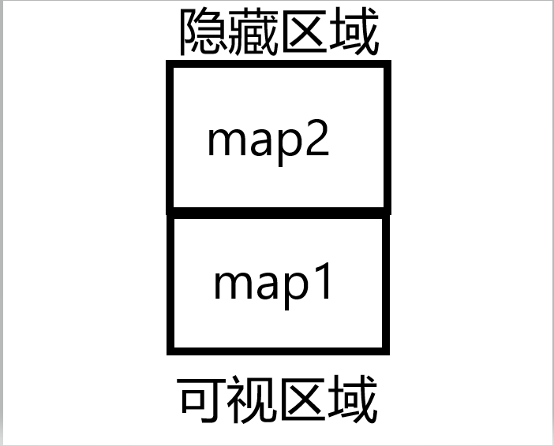
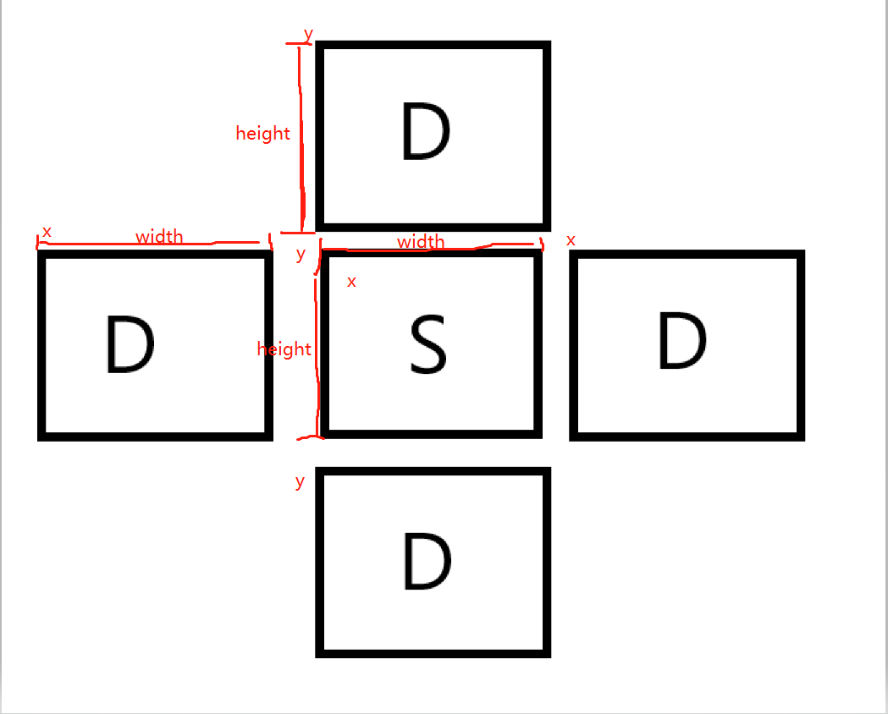

在之前的准备工作都做好之后，我们就可以开始在实际要进行操作的页面上大展手脚了。

## 地图动起来
首先我们要解决的就是让地图先动起来，这里我们只需要做最简单的无缝滚动即可。那么如何做呢？

这里我们需要两张地图，一张显示在可视区域，一张在可视区域上方，属于被隐藏的区域：



那么我们只需要在进入页面之后，让两张图的 Y 坐标递增，就可以做到让地图下移的视觉效果，然后当可视区域范围内的地图的 Y 坐标大于地图高度时，将当前地图的 Y 坐标重置成负的地图高度，就做到了无缝滚动的结果。

而这里的递增效果，我们可以使用 pixi.js 中的 ticker 来实现。实现之后我们在离开当前页面的时候销毁掉这个定时器。

根据分析的结果，我们来修改一下 Map.js：
```js
import { h, defineComponent, ref, onMounted, onUnmounted } from '@vue/runtime-core';
import mapImage from '@/assets/map.jpg';
import { game } from '../Game';

// 只展示 map
export default defineComponent({
  setup(props, ctx) {
    const viewHeight = 900;  // 图的高度
    const mapY1 = ref(0);  // 图一的 y 坐标
    const mapY2 = ref(-viewHeight);  // 图二的 y 坐标

    // 无缝轮播，使用 pixi.js 中封装的事件循环 ticker，实现 interval
    const speed = 5;  // 速度

    const moveLoop = () => {
      mapY1.value += speed;
      mapY2.value += speed;

      if (mapY1.value >= viewHeight) {
        mapY1.value = -viewHeight
      }
      if (mapY2.value >= viewHeight) {
        mapY2.value = -viewHeight
      }
    }
    onMounted() {
      game.ticker.add(moveLoop)
    }
    
    onUnmounted() {
      game.ticker.remove(moveLoop)
    }

    return {
      mapY1,
      mapY2
    }
  },
  render(ctx) {
    return h("Container", [
      h("Sprite", {
        texture: mapImg,
        y: ctx.mapY1
      }),
      h("Sprite", {
        texture: mapImg,
        y: ctx.mapY2
      })
    ])
  }
})
```

ref 这里是做响应式数据处理，Vue3 中再没有 data 去处理响应式数据了，它将所有的数据处理和生命周期都放在了 setup 入口函数里。这样可以使整个应用程序更加灵活，而非像 Vue2.x 那样将所有数据结构都规划好。

入口函数中将设置的响应式数据 return 出去，这样可以将数据挂载到 ctx 上，并在 render 中去使用。

此时属于地图组件的无缝轮播效果就做好了。

当然，我们在这里最好是加上一些优化，比如进入到地图页面时，地图再进行无缝滚动的效果，而当离开时，清除掉无缝滚动效果，释放内存。

## 我方飞机
接下来就是在地图上添加我方战机进去。

我们照旧先写一个我方飞机的组件出来，在这个组件里，我们需要一张我方飞机的图片，还需要一个初始化的 x 坐标和 y 坐标。当然，如果要让飞机动起来，我们还需要监听 keydown，即键盘按下的事件。而这个事件我们需要到父组件去监听，然后将对应的坐标传到子组件进来。

我们先将我方飞机画出来：
```js
// ./Plane.js

import { h, defineComponent, watch, reactive, toRefs } from '@vue/runtime-core';
import planeImg from '@/assets/plane.png';

export default defineComponent({
  props: ['x', 'y'],  // 父组件传递来的数据
  setup(props, ctx) {
    const point = reactive({
      x: props.x,
      y: props.y
    })

    watch(props, (value) => {
      point.x = value.x
      point.y = value.y
    })

    return {
      point
    }
  }
  render(ctx) {
    return h("Container", {
      x: ctx.point.x,    // 飞机的 x 坐标
      y: ctx.point.y     // 飞机的 y 坐标
    }, [
      h("Sprite", {
        texture: planeImg
      })
    ])
  }
})
```

我们这里为什么要使用 reactive 再来创建一个响应式对象呢？

这是因为此时 props 对象是一个只读的响应式对象，所以当父级的值发生变化时，我们并不能去直接使用，而是需要用 watch 去监听 props 的变化，再将其赋值给创建的新的响应式数据，最后将这个数据返回出去。

这个时候，我们就可以使用已经挂载到 ctx 上的 x 和 y 值，来控制飞机的飞行方向和速度。

除了使用 watch 之外，还有一种方法——toRefs：
```js
// ./Plane.js

import { h, defineComponent, watch, reactive, toRefs } from '@vue/runtime-core';
import planeImg from '@/assets/plane.png';

export default definedComponent({
  props: ['x', 'y'],
  setup(props, ctx) {
    const { x, y } = toRefs(props);

    return {
      x,
      y
    }
  }
  render({x, y}) {
    return h("Container", {
      x,
      y
    }, [
      h("Sprite", {
        texture: planeImg
      })
    ])
  }
})
```

当我们直接解构 props 时，得到的 x 和 y，只是一个初始值，跟上述一样，并且此时并不是 proxy 对象，这是一个响应式丢失问题，为了解决这个问题，我们需要借助 toRefs 方法将其重新转为响应式对象，这样解构出来的 x 和 y 也就是响应式数据了。最后将得到的数据返回出去即可。

做完这些工作之后，我们到父组件去写操作飞机移动的逻辑：
```js
// ./GamePage.js

// 定义一个 usePlaneInfo 的方法
function usePlaneInfo() {
  const planeInfo = reactive({
    x: 150,
    y: 450,
    width: 258,
    height: 364
  })

  // 键盘控制飞机的移动
  const speed = 15;
  window.addEventListener("keydown", (e) => {
    switch(e.code) {
      case "ArrowUp":
        planeInfo.y -= speed;
        break;
      case "ArrowDown":
        planeInfo.y += speed;
        break;
      case "ArrowLeft":
        planeInfo.x -= speed;
        break;
      case "ArrowRight":
        planeInfo.x += speed;
        break;
      default:
        break;
    }
  })

  return planeInfo
}

import { h, defineComponent, reactive } from '@vue/runtime-core';
import Plane from './Plane'

export default defineComponent({
  setup(props, ctx) {
    const planeInfo = usePlaneInfo()

    return {
      planeInfo
    }
  }
  render(ctx) {
    return h("Container", [
      h("Plane", {
        x: ctx.planeInfo.x,
        y: ctx.planeInfo.y
      })
    ])
  }
})
```

此时当我们按下键盘的上下左右时，就会控制飞机在地图上的移动。

## 敌方飞机
现在我方飞机有了，那还得有敌方飞机，实现方法和思路都有一样的，不同的是，敌方飞机不需要我们去操控，而是在创建后，自动向下移动。
```js
// ./EnemyPlane.js

import { h, defineComponent, toRefs } from '@vue/runtime-core';
import enemyPlaneImg from '@/assets/enemy.png';

export default defineComponent({
  props: ['x', 'y'],
  setup(props) {
    const { x, y } = toRefs(props)

    return {
      x, y
    }
  }
  render({ x, y }) {
    return h("Container", {
      x,
      y
    }, [
      h("Sprite", {
        texture: enemyPlaneImg
      })
    ])
  }
})
```

在父组件中引用，并将下移逻辑添加到里面：
```js
// ./GamePage.js
import { h, defineComponent, reactive, onMounted, onUnmounted } from '@vue/runtime-core';
import EnemyPlane from './EnemyPlane.js';
import { game } from './Game';

export default defineComponent({
  

  function useCreateEnemyPlanes() {
    const enemyPalnes = reactive([
      {
        x: 50,
        y: 0,
        width: 308,
        height: 207
      }
    ])
    return enemyPalnes
  }

  // 我们可以将敌我双方的逻辑写到一个回调中，先将其称之为战斗逻辑
  function useFighting(enemyPalnes) {
    const handlerTicker = () => {
      enemyPalnes.forEach((enemyPlane) => {
        enemyPlane.y++
      })
    }

    // 在页面渲染后执行定时
    onMounted() {
      game.ticker.add(handlerTicker)
    }

    // 在页面销毁时清掉定时,释放内存
    onUnmounted() {
      game.ticker.remove(handlerTicker)
    }
  }

  setup() {
    const enemyPalnes = useCreateEnemyPlanes()

    return {
      enemyPalnes
    }
  }
  render(ctx) {
    const createEnemyPlanes = () => {
      return ctx.enemyPalnes.map(enemyPlaneInfo => {
        return h(EnemyPlane, { x: enemyPlaneInfo.x, y: enemyPlaneInfo.y })
      })
    }

    return h("Container", [
      ...createEnemyPlanes()
    ])
  }
})
```

这样就把敌方飞机向下移动的效果完成了，并且在离开这个页面时，会销毁下移的定时，保证了应用程序的垃圾回收机制，不会造成内存泄露。

## 碰撞检测
重头戏来了，我方飞机有了，敌方飞机也有了，如何判断他们相撞呢？

我们先假设不相撞的情况，敌军飞机我们简称D，我方飞机我们简称S：
1. D 的 x 坐标加 D 的宽度小于 S 的 x 坐标；
2. D 的 y 坐标加 D 的高度小于 S 的 y 坐标；
3. S 的 x 坐标加 S 的高度小于 D 的 x 坐标；
4. S 的 y 坐标加 S 的高度小于 D 的 y 坐标；


