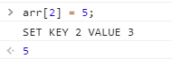
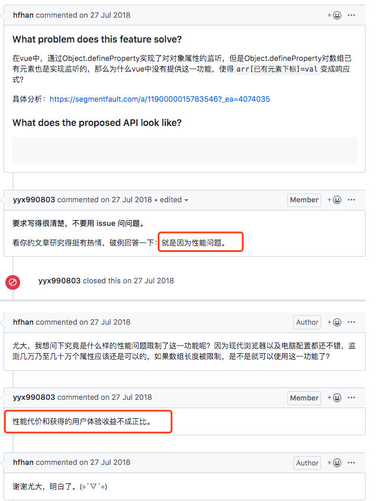

## 什么是响应式？

直观一点讲：数据改变页面更新，页面更新改变数据。当然名字也很多，比如双向数据绑定、数据驱动等等。

## Vue2.x 响应式原理

Vue2.x 实现数据双向绑定的原理是调用了 Object 的 `defineProperty` API。通过 `setter\getter` 来劫持各个属性。这里还涉及到发布订阅模式，当属性数据变动的时候，就会发布信息给订阅者，触发相应的监听回调。

常规方式去添加和修改对象属性：

```js
var obj = {}
obj.name = 'cecil';
onsole.log(obj);  // { name: 'cecil' }
```

而使用 `Object.defineProperty` 添加或修改对象属性的话，我们先要知道 `defineProperty` 的一些属性和方法：

首先我们说 `Object.defineProperty` 方法会直接在一个对象上定义一个新属性，或者说修改一个对象的现有属性，并返回此对象。

语法：
```js
Object.defineProperty(
  obj,              // 要定义属性的对象
  prop,             // 要定义或修改的属性名或 Symbol
  descriptor        // 要定义或修改的属性描述符
)
```

我们经常会用赋值的方式添加属性，这种属性是可枚举的，在枚举对象属性时会被枚举到（`for...in` 或 `Object.keys` 方法），可以改变这些属性的值，也可以删除这些属性。

默认情况下，使用 `Object.defineProperty` 添加的属性值是不可修改的。但是也允许修改默认的额外配置项。

对象里目前存在的属性描述符有两种主要形式：
::: tip
1. 数据描述符：一个具有值的属性，该值是可写的，当然也可以是不可写的；
2. 存取描述符：是由 `getter` 和 `setter` 函数所描述的属性。
:::

一个描述符只能是这两者其中之一，不能同时具有两种描述符。

这两种描述符都是对象。它们共享一下属性：
::: tip
- enumerable: 属性是否可枚举，默认是 false
- configurable: 属性是否可被删除，以及除 `value` 和 `writable` 特性外的其他特性是否可以被修改，默认是 false
- writable: 属性是否只读，默认 false
- value：属性的值，默认是 undefined
:::

存取描述符还具有以下可选键值：
::: tip
- get：属性的 `getter` 函数，如果没有 `getter`，则默认为 `undefined`。当访问该属性时，会调用此函数。执行时不传入任何参数，但是会传入 `this` 对象（由于继承关系，这里的 `this` 并不一定是定义该属性的对象）。该函数的返回值会被用作属性的值。
- set：属性的 `setter` 函数，如果没有 `setter`，则默认为 `undefined`。当属性值被修改时，会调用此函数。该方法会接受一个参数（也就是被赋予的新值），会传入赋值时的 `this` 对象。
:::

画个表应该更直观：
|  | configurable | enumerable | value | writable | get | set |
| - | - | - | - | - | - | - |
| 数据描述符 | 可以 | 可以 | 可以 | 可以 | 不可以 | 不可以 |
| 存取描述符 | 可以 | 可以 | 可以 | 可以 | 可以 | 可以 |

> 这些选项不一定是自身属性，也要考虑继承来的属性。为了确保保留这些默认值，在设置之前，可能要冻结 `Object.prototype`，明确指定所有的选项，或者通过 `Object.create(null)` 将 `__proto__(en-US)` 属性指向 `null`。

这里需要注意一点的就是继承。

如果访问者的属性是被继承的，那它的 `get` 和 `set` 方法会在子对象的属性被访问或者修改时被调用。如果这些方法用一个变量存值，该值会被所有对象共享。如果不想这样，就在内部设置一个值即可。

```js
function myclass() {
}

var value;
Object.defineProperty(myclass.prototype, "x", {
  get() {
    return value;
  },
  set(x) {
    value = x;
  }
});

Object.defineProperty(myclass.prototype, "y", {
  get() {
    return this.stored_x;
  },
  set(x) {
    this.stored_x = x;
  }
});


var a = new myclass();
var b = new myclass();
// 数据共享
a.x = 1;
console.log(b.x); // 1

// 数据不共享，不像访问者属性，值属性始终在对象自身上设置，而不是一个原型
a.y = 1;  // 1
console.log(b.y); // undefined
```

当然，如果一个不可写的属性被继承，它仍然可以防止修改对象的属性。

## 一，数据描述

```js
var vm = {}
Object.defineProperty(vm, 'name', {
  value: 'cecil',
  writable: true,
  configurable: true,
  enumerable: true
})

console.log(vm);  // { name: 'cecil' }

Object.defineProperty(vm, 'age', {
  value: 27,
  writable: false,
  configurable: false,
  enumerable: true
})

vm.age = 18;
console.log(vm.age);  // 依旧是 27，因为是只读，不可被修改
```

## 二、存储描述

```js
/**
 * set 方法 当我们修改属性的时候，会执行这个方法，新属性的值作为参数传递进来，默认值为 undefined
 * get 方法，当我们访问属性的时候，会执行这个方法，默认值是 undefined
 */

let name = '',
    getCount = 0,
    setCount = 0;

Object.defineProperty(vm, 'obs', {
  get: function () {
    console.log(`访问了 GET ${++getCount}次`);
    return name;
  },
  set: function (val) {
    console.log(`设置了 SET ${++setCount}次`);
    name = val;
  }
})

vm.obs;
vm['obs'];
vm.obs = '憨憨';
vm.obs = '真憨憨';
```

::: tip 缺陷
### 缺陷一：无法检测到对象属性的添加和删除

这个很好理解，因为 JavaScript 本身的动态性，可以为对象追加新的属性或者删除其中的某个属性，而 `Object.defineProperty` API 创建的响应式对象，只能监听已有属性的修改变化，但是对于新添加或者删除的属性，就没办法监听到。

### 缺陷二：不能检测数组长度的变化，准确的说是通过改变length而增加的长度，所以也就不能监听到原生数组的一些方法

为什么会这样呢？

首先我们要知道数组的 `length` 属性，被初始化为：
```js
{
  enumberable: false,
  configurable: false,
  writable: true
}
```

也就是说 `length` 属性默认是不可枚举的，也是不能被删除和修改（不是赋值）的。那此时如果再要使用 `defineProperty` 去修改 `length` 的话就是行不通的。

而当我们给数组添加新值之前，Vue 在构造函数中就已经为所有属性做了检测绑定的操作，所以后续动态添加的值和属性肯定也是监听不到的。 

而 Vue2.x 官方文档中也指出，不能监听在数组中利用索引直接设置一个项，和修改数组的长度。第二个的原因，前面已经指出为什么了。那第一个的原因，是为什么呢？是 `Object.defineProperty` API 自身不具备这种能力吗？

来看个例子吧

```js
function defineReactive(data, key, value) {
  Object.defineProperty(data, key, {
    enumerable: true,
    configurable: true,
    get: function () {
      console.log(`GET KEY ${key} VALUE ${value}`);
      return value;
    },
    set: function (val) {
      console.log(`SET KEY ${key} VALUE ${value}`);
      value = val;
    }
  })
}

function observe(data) {
  Object.keys(data).forEach((key) => {
    defineReactive(data, key, data[key]);
  })
}

let arr = [1, 2, 3]
observe(arr);
```

然后我们在控制台可以测试一下：



可以看到，通过索引来改变 `arr[2]` 是可以触发 set 的，那 Vue2.x 为什么没有实现呢？



Vue 的作者尤雨溪解释是因为性能问题。
:::

所以从这里来看的话，`Object.defineProperty` API 对于数组和对象来说，其表现是一样的，数组的索引可以看成是对象的 `key`：
- 当我们访问数组或者对象的某个属性值时，就会触发 `getter` 和 `setter`；
- 对于数组来说，只要是新增的值，都不会被监听到；
- 而如果使用 pop 或者 shift 方法删除数组中的元素，则会更新索引，从而触发 `getter` 和 `setter`。

## Vue3.x 响应式原理

Vue3.x 版本跟 Vue2.x 相比，变化还是蛮大的，首先从响应式实现原理上就做出了很大的改变，Vue2.x 是使用 `Object.defineProperty` 来实现的响应式，而 Vue3.x 则是使用 `Proxy` 代理来实现的响应式。

从代码结构上 Vue3.x 的响应式代码是放在 `./packages/reactivity` 目录里的，而且其本身都是使用 TypeScript 进行重构的。

## 实现迷你Vue3

