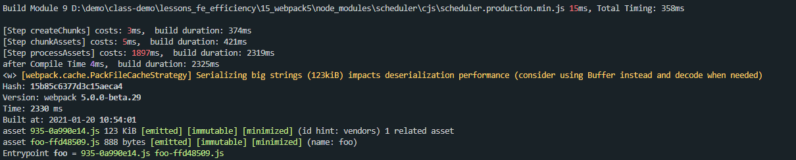
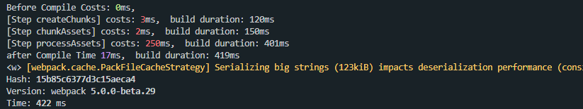
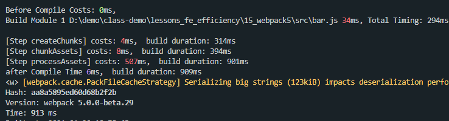

本文是笔者笔记，原文[传送门](https://kaiwu.lagou.com/course/courseInfo.htm?courseId=416#/detail/pc?id=4429)

[[toc]]

## Webpack5 中的效率优化点
- Persistent Caching
- Tree Shaking
- Logs

### Persistent Caching
webpack5 中缓存方面的变化。

那第一个应该就是**持久化缓存**。先来看看代码：
```js
// ./webpack.config.js
...
module.exports = {
  ...
  cache: {
    type: 'filesystem',
    cacheLocation: path.resolve(__dirname, '.appcache'),
    buildDependencies: {
      config: [__filename]
    }
  }
  ...
}
```
初次构建


在不修改代码进行再次构建


修改代码后再次构建


可以看到，初次构建时间花掉了2330ms，而在不修改代码的情况下再次构建所花费的时间422ms，修改代码后再次构建花费了913ms，多花费的时间体现在构建被修改的文件编译上，这就实现了**生产环境下的增量构建**。

### Cache 基本配置
在 webpack4 中，cache 只是单个属性的配置，所对应的赋值为 true 或 false，用来代表是否开启缓存，或者赋值为对象来表示在构建中使用的缓存对象。而在 webpack5 中，cache 配置除了原本的 true 和 false 之外，还增加了许多的自配置项。
- **cache.type**：缓存类型。值为 `memory` 或 `filesystem`，分别代表基于内存的临时缓存，以及基于文件系统的持久化缓存。在选择 filesystem 的情况下，下面的其他配置项生效。 
- **cache.cacheDirectory**：缓存目录。默认目录为 `node_modules/.cache/webpack` 。
- **cache.name**：缓存名称。同时也是 cacheDirectory 中的子目录命名，默认值为 webpack 的 `${config.name}-${config.mode}`。
- **cache.cacheLocation**：缓存真正的存放地址。默认使用的是上述两个属性的组合：`path.resolve(cache.cacheDirectory, cache.name)`。该属性在赋值情况下将忽略上面的 `cacheDirectory` 和 `name` 属性。

### 单个模块的缓存失效
