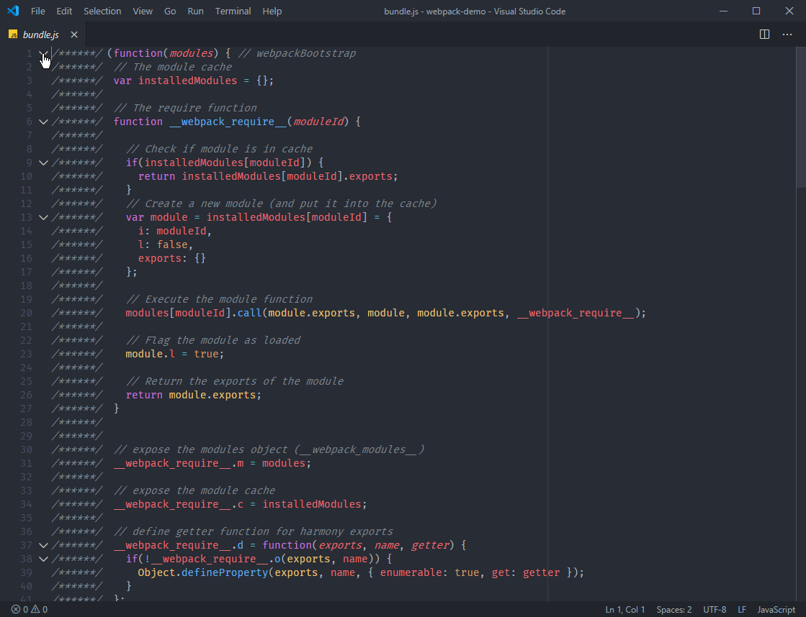
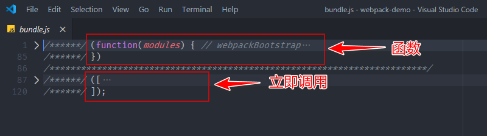
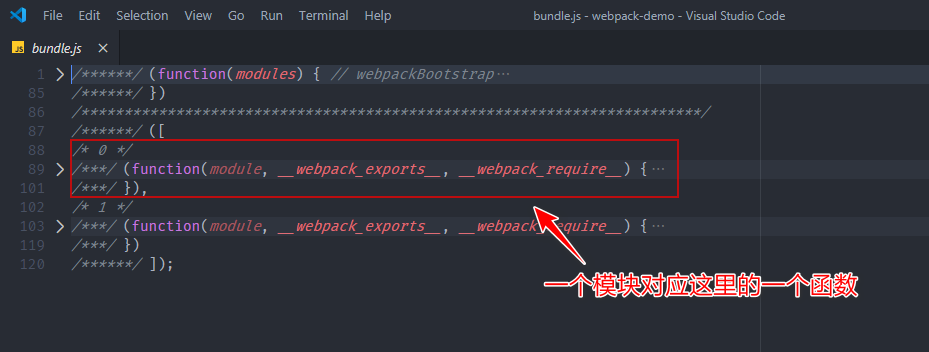
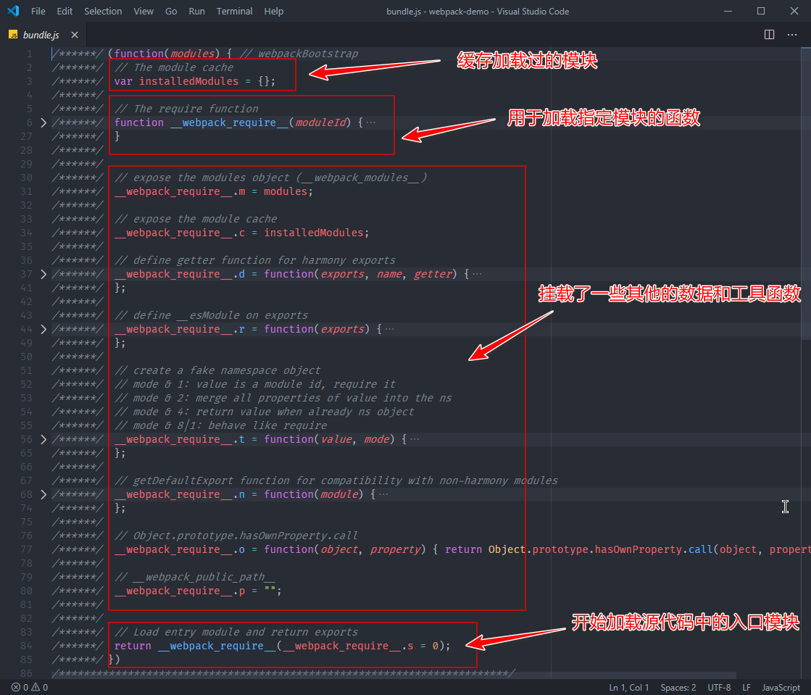

我们来一起看下 Webpack 打包后生成的 bundle.js 文件，深入了解 Webpack 是如何把这些模块合并到一起，而且还能正常工作的。

为了更好的理解打包后的代码，我们先将 Webpack 工作模式设置为 none，这样 Webpack 就会按照最原始的状态进行打包，所得到的结果更容易理解和阅读。

按照 none 模式打包完成后，我们打开最终生成的 bundle.js 文件，如下图所示：

折叠代码后，再看下整体的结构：

整体生成的代码其实就是一个立即执行函数，这个函数是 Webpack 工作入口（webpackBootstrap），它接收一个 modules 参数，调用时传入了一个数组。

展开这个数组，里面的元素均是参数列表相同的函数。这里的函数对应的就是我们源代码中的模块，也就是说每个模块最终被包裹到了这样一个函数中，从而实现模块私有作用域.

展开工作入口函数：

这个函数内部并不复杂，而且注释也很清晰。

1. 最开始定义了一个 installedModules 对象用于存放或者缓存加载过的模块。
2. 紧接着定义了一个 require 函数，顾名思义，这个函数是用来加载模块的。
3. 再往后就是在 require 函数上挂载了一些其他的数据和工具函数，这些暂时不用关心。
4. 最后调用了 require 函数，传入的模块 id 为 0，开始加载模块。模块 id 实际上就是模块数组的元素下标，也就是说这里开始加载源代码中所谓的入口模块。

