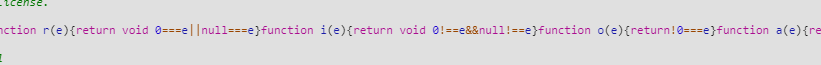
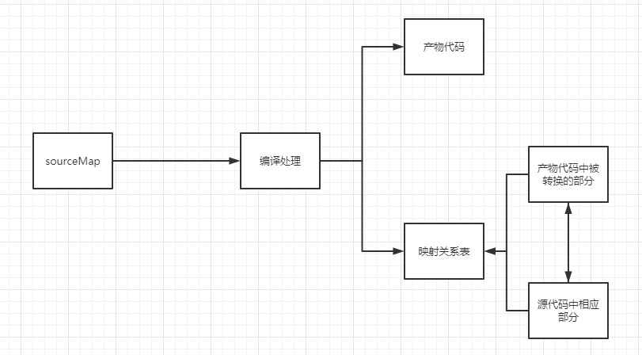

[[toc]]

## 什么是 Source Map

**SourceMap**的作用：在调试的时候将产物代码显示回源代码的功能。

场景：通常在开发中，我们编写的代码会经过编译、封装、压缩等处理，最后形成处理过后的代码，而这种代码在浏览器中进行调试时会发现可读性很差，基本上面目全非了。

基本原理：编译的过程中，在生成产物代码的同时，生成产物代码中被转换的部分与源代码中相应部分的映射关系表。

有了这样一张完整的映射表，我们就可以通过浏览器控制台中的"Enable JavaScript source map"来实现调试时的显示与定位源代码功能。

对于同一个源文件，根据不同的目标，可以生成不同效果的 source map。它们在以下几个等方面也各不相同：

- **构建速度**
- **质量**：反解代码与源代码的接近程度以及调试时行号列好等辅助信息的对应情况
- **访问方式**：在产物文件中或是单独生成 source map 文件
- **文件大小**

在开发环境和生产环境下，我们对于 source map 功能的期望也有所不同：

- **开发环境**：通常我们关注的是构建速度快，质量高，以便于提供开发效率，而不关注生成的文件大小和访问方式。
- **生产环境**：通常我们更关注是否需要提供线上 source map，生成的文件大小和访问方式是否会对页面性能造成影响等，其次才是质量和构建速度。