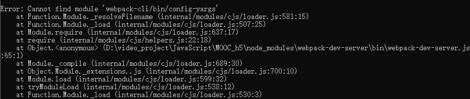
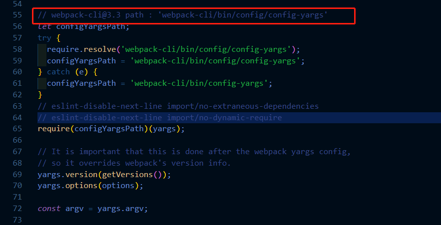

在使用webpack的时候，我们会遇到webpack-cli与webpack-dev-server两个之间版本不匹配的问题，然而又对两个版本之间哪两个相匹配一头雾水，这里其实我们在启动webpack-dev-server的时候，如果出现不匹配的问题，会明确给我们指出来，我们只要顺着去找就OK了。

比如现在我启动webpack-dev-server的时候报错了，报错信息如下：

可以看到，提示在 node_modules目录下的 webpack-dev-server 中有一个bin目录，而正是这个目录里的 webpack-dev-server.js 文件里的第65行抛出的错误，那么我们进入到这个文件中去查看一下：

简直一目了然有没有，我的天，重新安装 webpack-cli，开搞！